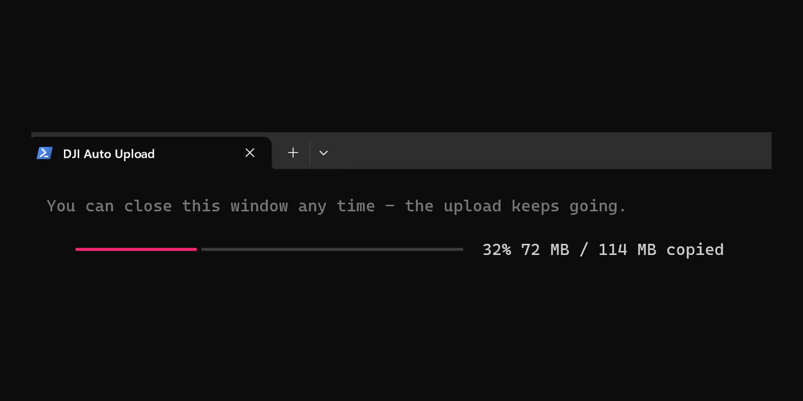

# dji-auto-upload

> Plug in your DJI drone, walk away, and your footage copies itself off.

[](https://github.com/szilvasolutions/dji-auto-upload/actions/workflows/ci.yml)
[](LICENSE)
[](https://www.python.org/downloads/)
[](#install)
[](#macos)
[](https://buymeacoffee.com/szilvasolus)

My DJI Neo 2 has no SD card. Everything it records sits on internal storage, and
there are only two ways to get it off: the DJI app, which does a slow Wi-Fi
transfer to my phone that I have to sit and watch, or a USB cable. Neither is
something I want to deal with after a flight.

So I stopped dealing with it. Now I land, walk inside, and plug the drone into my
computer. By the time I've put it down the new clips are already copying, and the
drone's storage is clearing space for next time. No app, no dragging files, no
clicking.

It works the same whether your footage lives on internal storage (Neo) or an SD
card (Mini, Mavic, goggles). Either way the storage never fills up.



## What it does

Plug in a DJI device and it copies the new clips off, grouped by the day you shot
them. If you want, it then uploads them to your cloud and trims the copies it has
safely stored off the device.

* Cloud is optional. Setup asks. Say no and it just copies into a folder you pick,
  with no accounts and nothing to sign in to.
* Nothing is deleted unless you ask for it, on the drone or on your computer.
* A clip is only ever removed from the drone once that exact file (matched by name
  and size) is confirmed at its destination.
* Interrupted transfers resume where they stopped, and nothing is uploaded twice.
* You can watch it work, and closing the progress window will not stop it.
* It tells you when it finished, and what went wrong if it didn't.

## Which devices work

If your computer sees the device as a USB drive with a `DCIM` folder, this handles
it: the drones (Neo, Mini, Air, Mavic, Avata, FPV), the FPV goggles, and the Osmo
Action and Pocket cameras.

Detection doesn't actually require a DJI. It checks DJI's USB vendor ID and the
`DJI` / `DJIMEDIA` volume labels first, but the fallback is simply "is there a
`DCIM` folder here", so new models tend to work on day one.

One thing to watch: some devices ask you to pick a mode when you plug them in.
Choose **mass storage** or **USB drive**, not MTP. An MTP device never mounts as a
drive, so nothing that watches for drives can see it.

## Install

One command. It installs Python if you need it, installs the tool, and starts
setup.

**Windows** (paste into PowerShell):

```powershell
irm https://raw.githubusercontent.com/szilvasolutions/dji-auto-upload/main/install.ps1 | iex
```

**macOS and Linux:**

```bash
curl -fsSL https://raw.githubusercontent.com/szilvasolutions/dji-auto-upload/main/install.sh | bash
```

rclone is not installed at this point. Setup asks whether you want cloud upload
first, and only offers to install rclone if you say yes.

<details>
<summary>Prefer to install by hand</summary>

Needs Python 3.10 or newer.

```bash
pip install dji-auto-upload
dji-auto-upload setup
dji-auto-upload install-trigger   # sudo on Linux
```

</details>

<details>
<summary>Linux notes</summary>

Run `setup` as your normal user, not with `sudo`, so the config lands in your home
directory. `install-trigger` then points the udev rule at that config and at your
`rclone.conf`, and tells you which files it picked. Without that the triggered run
executes as root, reads `/etc/dji-auto-upload/`, and quietly falls back to
defaults.

```bash
sudo dji-auto-upload install-trigger   # writes /etc/udev/rules.d/99-dji-auto-upload.rules
```

The rule dispatches through `systemd-run` (no `--scope`, with `--collect`) so the
offload runs as a child of PID 1. That matters because `systemd-udevd` runs its
workers under a seccomp filter that blocks the `mount(2)` syscall. Logs go to
`journalctl`.

</details>

<details id="macos">
<summary>macOS notes (not yet tested on real hardware)</summary>

Every code path here is implemented and covered by CI, but nobody has plugged a
real DJI device into a real Mac with this installed. If you try it, I'd like to
hear how it went; `dji-auto-upload diagnose` output in an issue is the most useful
thing you can send.

```bash
dji-auto-upload install-trigger   # writes ~/Library/LaunchAgents/com.dji-auto-upload.watcher.plist
```

That registers a per-user LaunchAgent running a watcher that polls `/Volumes`
every 3 seconds. Its log:

```bash
tail -f ~/Library/Logs/dji-auto-upload/watcher.err.log
```

</details>

<details>
<summary>Windows notes</summary>

`install-trigger` registers a per-user Scheduled Task, no admin needed. It runs a
windowless watcher that polls for new drives every 3 seconds. When a DJI volume
appears, the offload starts in a hidden detached process and a separate progress
window opens, which you can close at any time without affecting the transfer.

The task showing `Ready` rather than `Running` is normal: its action is a small
launcher that starts the watcher and exits. To check the watcher itself:

```powershell
Get-Content "$env:LOCALAPPDATA\dji-auto-upload\watcher.log" -Tail 20
```

</details>

## Setup

`dji-auto-upload setup` asks a handful of questions and can be re-run at any time.
Your edits to the config file survive.

**Where should the footage go.** Cloud, or just a folder on this computer. Local
means no rclone, no accounts, and nothing to sign in to.

**Which folder on this computer.** Setup creates it, checks it's writable, and
tells you how much space is free. In local-only mode this folder is your only
copy, so it is never cleaned up automatically.

**Whether to delete anything.** Both answers default to no. You can let it trim
clips off the drone once they're safely stored, and you can let it remove local
copies once they're uploaded. Neither happens unless you say so.

**Telegram notifications** (optional). Setup walks you through a bot token from
`@BotFather` and picks up your chat ID from the next message you send the bot, so
there's nothing to copy out of a `getUpdates` URL.

**The auto-trigger**, so plugging in a device starts a run.

### Setting up a cloud

Uploads go through [rclone](https://rclone.org), which speaks Google Drive,
Dropbox, OneDrive, Google Photos, S3, Backblaze B2, a NAS over SFTP or SMB, and
about 70 other backends. Setup asks which one, and offers to install rclone if you
don't have it.

For most providers `rclone config` is a single browser sign-in: choose "New
remote", pick your provider, follow the prompts, give it a name. Use that name in
setup. A path like `DJI/{date}` files each day's clips into its own folder.

If your provider isn't obvious, rclone's own docs have a page for every backend:
[rclone.org/docs](https://rclone.org/docs/#configure), for example
[Google Drive](https://rclone.org/drive/), [Dropbox](https://rclone.org/dropbox/),
[OneDrive](https://rclone.org/onedrive/).

Google Drive is the least hassle, and what most people should pick.

<details>
<summary>Google Photos needs one extra step</summary>

Google Photos works, but rclone's shared OAuth client is rate limited to roughly
10 GB a day. For your own quota, create your own client:

1. [console.cloud.google.com](https://console.cloud.google.com/), create a project
2. Enable the Photos Library API
3. OAuth consent screen, choose External, then **Publish App** so the token doesn't
   expire weekly
4. Credentials, create a **Desktop app** OAuth client, copy the `client_id` and
   `client_secret`
5. `rclone config`, new remote, `google photos`, paste those in

Then use a path of `album/DJI-{date}` so each date becomes its own album. On a
machine with no browser, forward the callback port over SSH with
`ssh -L 53682:127.0.0.1:53682 user@host` and open the URL rclone prints.

</details>

## Commands

```
dji-auto-upload setup              # the setup wizard, re-runnable
dji-auto-upload run                # one offload pass, autodetects the device
dji-auto-upload run --dry-run      # show the whole plan, change nothing
dji-auto-upload status             # settings, and how the last run went
dji-auto-upload watch-run          # live progress, safe to close
dji-auto-upload diagnose           # write a support bundle for a bug report
dji-auto-upload install-trigger    # install the plug-in trigger
dji-auto-upload uninstall-trigger  # remove it
dji-auto-upload update             # update and refresh the trigger
dji-auto-upload uninstall          # stop the trigger, remove settings, keep footage
dji-auto-upload test-notify        # send a test Telegram message
dji-auto-upload prune              # delete local copies past their retention
dji-auto-upload version
```

Just after a release, PyPI can serve the previous version for a minute or two
while its CDN catches up. If `update` reports an older version than you expect,
run it again shortly rather than assuming it failed.

## Configuration

`setup` writes a TOML file you can edit directly. Comments survive re-runs.

| OS | Path |
|---|---|
| Linux | `~/.config/dji-auto-upload/config.toml` |
| macOS | `~/Library/Application Support/dji-auto-upload/config.toml` |
| Windows | `%APPDATA%\dji-auto-upload\config.toml` |

```toml
[remote]
enabled = true     # false = local only: no rclone, no upload, no accounts
name = "gphotos"
path_template = "album/DJI-{date}"   # {date} becomes YYYY-MM-DD

[paths]
# Where clips are kept on this computer. Empty = platform default.
# On Windows use single quotes: inside double quotes a backslash starts a TOML
# escape and the line is rejected.
stage_dir = ''     # e.g. 'D:\DJI' on Windows, '~/Videos/DJI' elsewhere

[retention]
stage_days = 0     # 0 = never delete local copies (default)
drone_days = 0     # 0 = never delete anything from the drone (default)

[detect]
sidecar_extensions = ["srt", "lrf"]  # removed only along with their video
strict_detect      = false           # true = require a DJI vendor ID or volume label

[behaviour]
disk_headroom_mb   = 512
verify_after_copy  = true
delete_drone_files = false   # master switch for trimming the drone
eject_when_done    = true    # eject when finished so it's safe to unplug
inhibit_sleep      = true    # keep the machine awake during a run

[notifier]
enabled = false
events  = ["start", "done_copy", "done_upload", "done", "fail"]
```

Telegram credentials live separately in `credentials.toml`, mode 0600.

## When something goes wrong

```bash
dji-auto-upload status      # how the last run went, and why it failed
dji-auto-upload diagnose    # one file with everything needed to debug it
```

`diagnose` writes a single support bundle: versions, your settings, which rclone
remotes exist, whether the trigger is installed and what it points at, and the
recent logs. Secrets are redacted. Attaching that to an issue is far more useful
than a description.

[docs/troubleshooting.md](docs/troubleshooting.md) covers the common cases per OS:
nothing happening on plug-in, an expired cloud connection, a device that mounts as
MTP instead of a drive, and where each log lives.

## Uninstall

The mirror of the install:

**Windows:**

```powershell
irm https://raw.githubusercontent.com/szilvasolutions/dji-auto-upload/main/uninstall.ps1 | iex
```

**macOS and Linux:**

```bash
curl -fsSL https://raw.githubusercontent.com/szilvasolutions/dji-auto-upload/main/uninstall.sh | bash
```

That stops the watcher, removes the trigger and settings, and uninstalls the
package. Your footage is not deleted and rclone is left alone. The script prints
where the folder is so you can decide for yourself.

To stop it watching but keep the program:

```bash
dji-auto-upload uninstall            # trigger and settings, footage untouched
dji-auto-upload uninstall --purge    # also delete the local footage folder
```

`--purge` refuses when that folder is your only copy (local-only mode) or when
anything in it hasn't reached the cloud yet.

## How it works

```
USB plug-in
    │
    ▼
┌────────────────────────────────────────────────┐
│  Per-OS trigger                                │
│  Linux:   udev rule -> systemd-run             │
│  macOS:   LaunchAgent -> /Volumes poll (3 s)   │
│  Windows: Scheduled Task -> drive poll (3 s)   │
└──────────────┬─────────────────────────────────┘
               │
               ▼
       dji-auto-upload run --device <volume>
               │
   ┌───────────┼───────────┬────────────┬──────────┐
   ▼           ▼           ▼            ▼          ▼
inventory   precheck     copy        upload     cleanup
 (group    (free space  (atomic     (rclone     (ledger-
  by date)  + headroom)  .part ->    --files-     gated)
                         replace)     from)
                                       │
                                       ▼
                              .uploaded ledger
```

The ledger is the safety mechanism. Each entry records a file's name and byte
size, meaning "this exact file reached its destination". Nothing is removed from
the drone unless an entry matches it, which is also why re-running never uploads
anything twice.

[docs/architecture.md](docs/architecture.md) has the full state machine, and
[docs/why.md](docs/why.md) explains the design decisions.

### If the computer sleeps anyway

A run holds a sleep inhibitor (`SetThreadExecutionState` on Windows, `caffeinate`
on macOS, `systemd-inhibit` on Linux), so an idle machine won't suspend mid
transfer.

It can't stop you closing the lid. If that happens nothing is lost and nothing is
duplicated: confirmed files are in the ledger, the rest are retried, and the drone
is never trimmed for a file that isn't confirmed. Plug in again and it picks up
where it stopped.

Set `inhibit_sleep = false` to leave your power settings alone.

## Development

```bash
git clone https://github.com/szilvasolutions/dji-auto-upload
cd dji-auto-upload
pip install -e ".[dev]"
pytest
ruff check .
mypy src
```

The integration tests build a synthetic DCIM tree and point the orchestrator at a
fake rclone binary ([tests/fixtures/fake_rclone.py](tests/fixtures/fake_rclone.py)),
then assert ledger contents, file placement, and notification ordering. The ones
worth reading first are in
[tests/integration/test_safety_features.py](tests/integration/test_safety_features.py),
which cover the cases where footage could be lost.

## Support this project

This is free and I build it in my spare time. If it saved you dragging files off a
drone, or you want to nudge a feature along, you can buy me a coffee. Bug reports
and pull requests are just as welcome.

<a href="https://buymeacoffee.com/szilvasolus" target="_blank"></a>

## License

MIT. See [LICENSE](LICENSE).

Uploads are performed by [rclone](https://rclone.org), a separate MIT-licensed
program that you install yourself. This project runs it, it does not include it.

DJI, Mavic, Mini, Air, Avata, Neo and Osmo are trademarks of SZ DJI Technology
Co., Ltd. This is an independent hobby project, not affiliated with, authorised by
or endorsed by DJI. The name describes what the tool works with, nothing more.
